# 毕业设计精选-基于springboot的物流管理系统的设计与实现

<h4 style='color:red'>联系不到我，就看我的主页 </h4> 
 
#### 系统概要

基于Spring Boot的物流管理系统是一款专为物流行业设计的综合性管理平台。系统主要分为两种角色：管理员和用户。管理员负责管理和监督物流信息，确保物流过程的顺畅和高效；用户则可以通过系统查看物流信息和运单状态，获取相关公告和通知。该系统通过集成多种功能模块，实现了物流信息的集中管理和高效处理。

#### 研究背景

互联网时代不仅仅是通过各种各样的电脑进行网络连接的时代，也包含了移动终端连接互联网进行复杂处理的一些事情。传统的互联网时代一般泛指就是PC端，也就是电脑互联网时代，但是最近几十年，是移动互联网时代，是向下一步互联网时代过度的一个重要时代，下一个互联网时代叫物联网，而移动互联网就是一个风口，是当前社会的主流风向。目前移动互联网大行其道，人人都手中拿着智能机，手机手机，手不离机，如果开发一个用在手机上的程序软件，那是多么的符合潮流，符合管理者和客户的理想。本次就是开发物流管理系统有管理员和用户两个角色。管理员功能有个人中心，用户管理，车辆信息管理，公告信息管理，司机管理，物流信息管理，运单信息管理，车辆类型管理，车辆状态管理，公告类型管理，物流状态管理，运单状态管理。用户可以注册登录，查看公告信息，查看物流信息，可以添加运单信息。

#### 技术栈

后端技术栈：Springboot+Mysql+Maven

前端技术栈：Vue+Html+Css+Javascript+ElementUI

开发工具：Idea+Vscode+Navicate

#### 系统功能介绍

管理员角色  
个人中心：管理员可以管理个人信息，修改密码，查看个人操作记录等。  
管理员管理：管理系统中的其他管理员信息，分配和调整管理员权限。  
车辆信息管理：记录和管理物流车辆的基本信息，包括车辆型号、车牌号码、维护记录等。  
基础数据管理：管理系统的基本信息和配置，如物流路线、仓库信息等。  
公告信息管理：发布和管理系统公告，确保重要信息及时传达给所有用户。  
司机管理：管理司机的基本信息和工作安排，确保司机资源的合理分配和使用。  
物流信息管理：跟踪和管理物流信息，包括物流路线、运输状态等，确保物流过程的顺畅。  
用户管理：管理系统用户信息，包括新增、删除、修改用户资料。  
运单信息管理：记录和管理物流运单信息，包括运单号、发货人、收货人、货物详情等。  

用户角色  
个人中心：用户可以管理个人信息，修改密码，查看个人操作记录等。  
公告信息管理：查看系统公告，了解最新的物流动态和重要信息。  
物流信息管理：查看物流信息，包括物流路线、运输状态等，了解货物的实时情况。  
运单信息管理：查看和管理自己的运单信息，包括运单号、发货人、收货人、货物详情等。  

#### 系统流程分析

分析程序的流程，涉及到程序的整体操作流程，通过分析与设计，绘制的程序操作流程图见下图。此程序为了确保安全，会让使用者通过登录模块验证信息，符合要求的使用者才有权限操作程序。

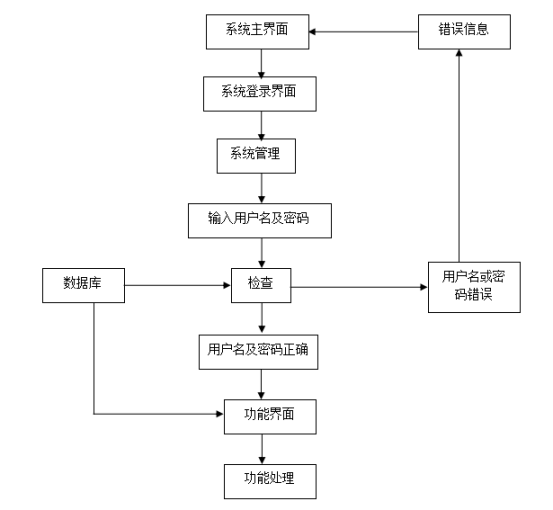

程序处理数据会涉及到数据的录入环节，绘制的添加流程见下图。程序录入数据过程中，始终与数据库保持同步。

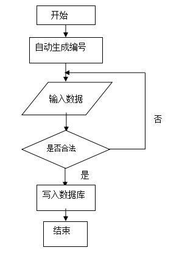

程序里面的数据也会出现错误，因此就有相应的修改数据的功能，绘制的程序修改流程见下图。此过程也是跟后台数据库进行数据同步显示。

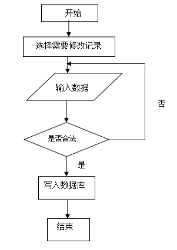

程序数据存放于数据仓库，有时也会涉及到数据删除，此过程对应的流程图见下图。数据信息被删除之后，数据库里面也就没有了该数据信息了。

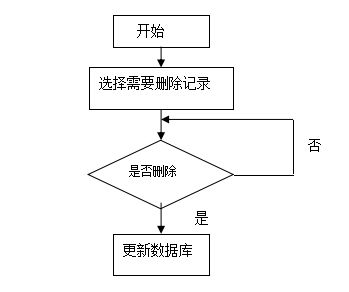

#### 功能结构设计

在管理员功能模块确定下来的基础上，对管理员各个功能进行设计，确定管理员功能的详细模块。绘制的管理员功能结构见下图。管理员可以管理所有，包含个人中心，用户管理，管理员管理，公告信息管理，咨询信息管理，车辆信息管理，物流信息管理，试题管理，系统管理，考试管理等。

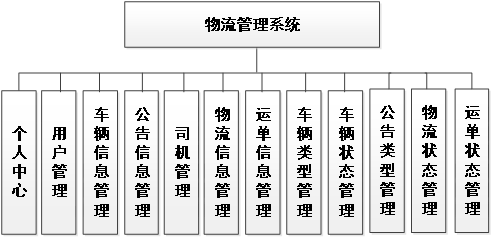

#### 系统作用

该物流管理系统在提高物流管理效率、确保信息准确性、促进用户沟通等方面发挥了重要作用。具体包括：

信息集中管理：通过系统将物流相关信息集中管理，避免信息分散、数据丢失等问题。  
实时信息追踪：用户可以通过系统实时追踪货物状态，了解物流进展，提高客户满意度。  
高效资源管理：管理员可以通过系统高效管理车辆和司机资源，优化物流路线和运输安排。  
有效沟通平台：通过公告信息管理功能，确保重要信息及时传达，促进管理员和用户之间的沟通。  
提升工作效率：通过系统自动化管理，减少了人工操作，提高了物流管理的效率和准确性。  

#### 系统功能截图

登录界面

用户管理

管理员可以对用户信息进行添加，修改，删除，查询操作。

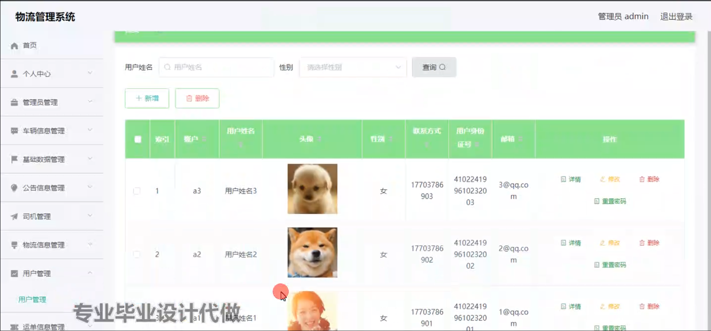

公告信息管理

管理员可以对公告信息信息进行添加，修改，删除，查询操作。

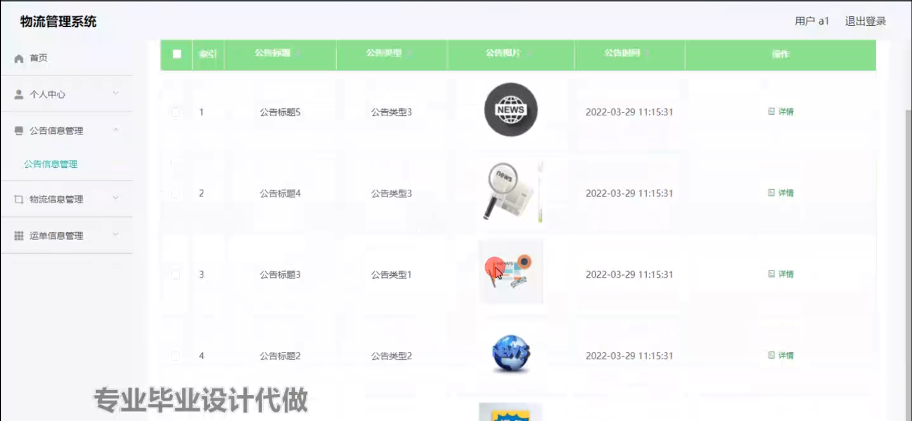

物流信息管理

管理员可以对物流信息进行添加，修改，删除，查询操作。

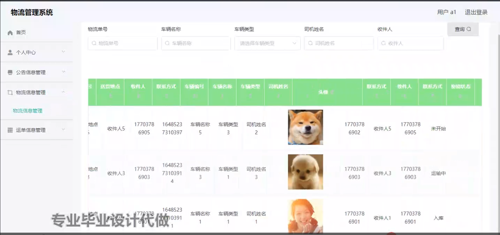

车辆信息管理

管理员可以对车辆信息进行添加，修改，删除操作。

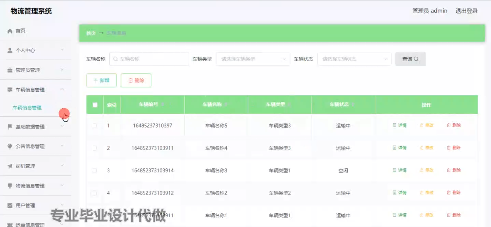

物流信息

用户登录后可以查看物流信息，可以看到物流信息状态和详情。

运单信息管理

用户可以对自己发布的运单信息进行添加修改删除查询操作。

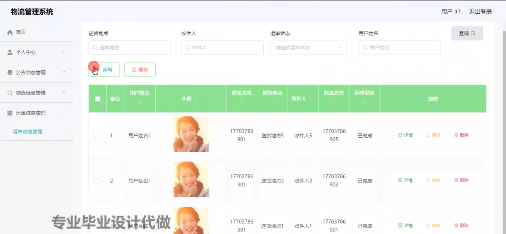

管理员端管理员管理

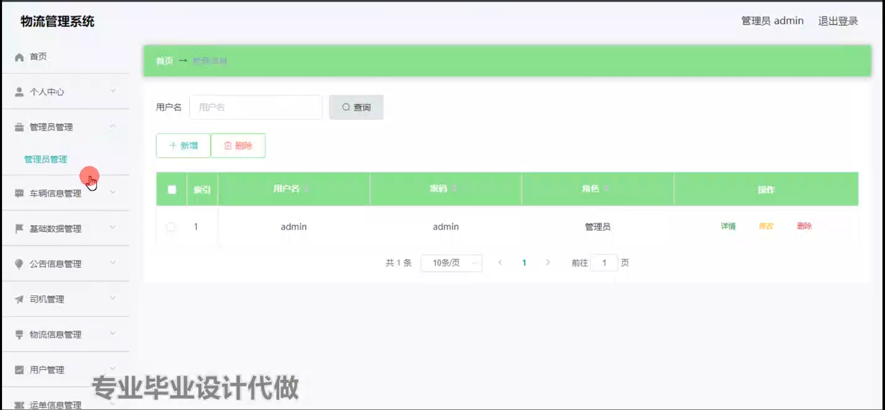

司机管理

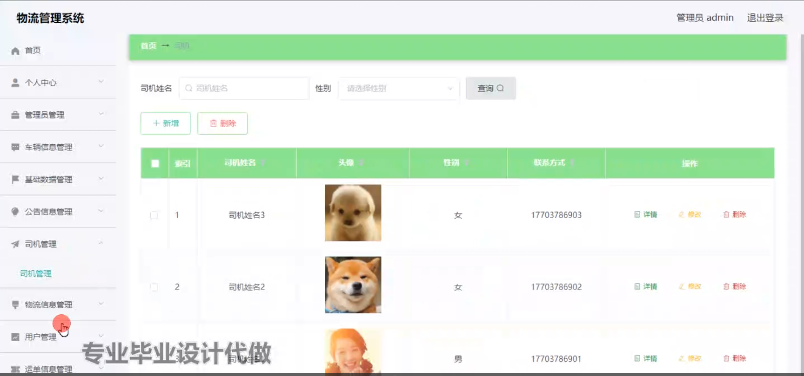

#### 总结

基于Spring Boot的物流管理系统是一款功能完善、用户友好的综合性物流管理平台。它不仅解决了传统物流管理方式的诸多弊端，还在信息管理、实时追踪、资源管理等方面提供了全方位的支持。然而，随着技术的发展和需求的变化，系统在功能扩展、用户体验优化等方面仍需不断完善。未来，可以结合物联网、大数据等技术，进一步提升系统的智能化水平和服务能力。

#### 使用说明

创建数据库，执行数据库脚本 修改jdbc数据库连接参数 下载安装maven依赖jar 启动idea中的springboot项目

后台登录页面
http://localhost:8080/wuliuguanliwu/admin/dist/index.html

管理员				账户:admin 		密码：admin

用户				账户:a1 		密码：123456